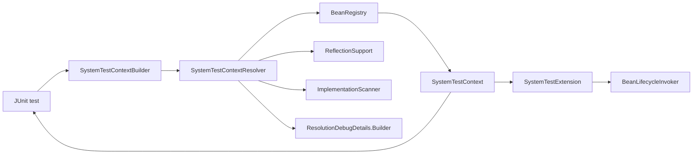

# Architecture

System Test Container is intentionally small. It resolves plain Java objects into a
`SystemTestContext` for tests and keeps Jakarta runtime behavior out of scope.

For detailed resolver rules, package names, debug fields, and lifecycle timing, see the
[Technical reference](TECHNICAL.md).

## Architecture Goals

| Goal | Impact |
| --- | --- |
| Small runtime surface | Tests stay fast and predictable. |
| Real code by default | Module behavior is tested through spies, not hand-built stubs. |
| Explicit external boundaries | Mocks make remote systems and infrastructure dependencies visible. |
| Clear diagnostics | Resolver failures include graph and path details. |

## Component View



## Main Components

- `SystemTestContextBuilder` validates root types, collects configuration, and starts resolution.
- `SystemTestContextResolver` resolves the graph and records diagnostics.
- `BeanRegistry` stores spies, mocks, aliases, and object creation state.
- `ReflectionSupport` selects constructors and injectable fields.
- `ImplementationScanner` finds simple package-local implementations for abstract dependencies.
- `SystemTestContext` exposes resolved spies, mocks, log configuration, and debug details.
- `SystemTestExtension` integrates Jakarta lifecycle callbacks with JUnit 5.
- `BeanLifecycleInvoker` validates and invokes `@PostConstruct` and `@PreDestroy` methods.

## Design Decisions

### No Runtime Container

The library does not emulate CDI or EJB. It supports only the annotations needed for test-time
wiring:

- `@Inject` constructors.
- `@Inject` fields.
- Field-level `@EJB`.
- `@PostConstruct` and `@PreDestroy` through the JUnit extension.

This keeps tests fast and avoids coupling them to an application server.

### Real Objects Inside the Boundary

Resolved concrete classes are wrapped as Mockito spies. This preserves real behavior while still
allowing Mockito verification.

External dependencies should be declared as mocks:

```java
SystemTestContext context =
    new SystemTestContextBuilder(OrderWorkflow.class)
        .mock(InventoryGateway.class)
        .build();
```

### Early Spy Registration

The resolver registers a spy before field injection. Another object can then reuse that spy, which
allows field-injected cycles to work.

Constructor-only cycles fail because no object exists until constructor arguments are resolved.

### Small Implementation Discovery

When an interface or abstract class is not explicitly mocked, the scanner looks for concrete
assignable classes in the dependency type package.

The beta intentionally fails on ambiguous implementations. Make the dependency explicit with
`.mock(type)` or adjust the fixture until qualifier-aware resolution exists.

### Separate Logs and Debug Details

`LogLevel` controls emitted logs through `System.Logger`. `DebugLevel` controls structured
diagnostics returned by the API. Tests can keep logs quiet while still inspecting debug details after
a failure.

## Compatibility Notes

- Public APIs may change before `1.0.0`.
- Debug JSON fields are useful for diagnostics but not yet a stable compatibility contract.
- Internal packages are not supported extension points.
