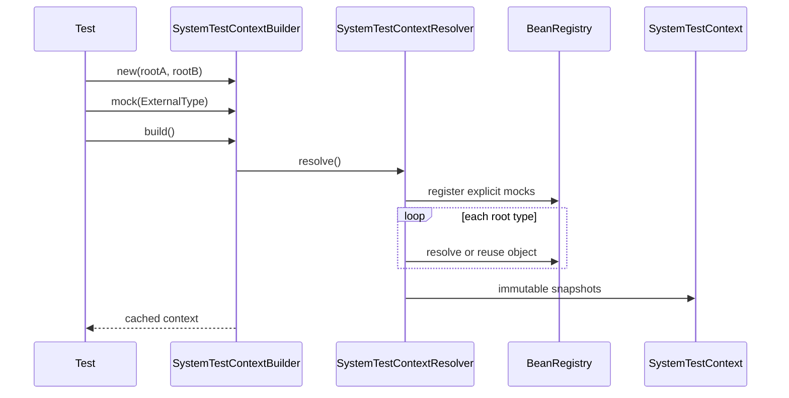
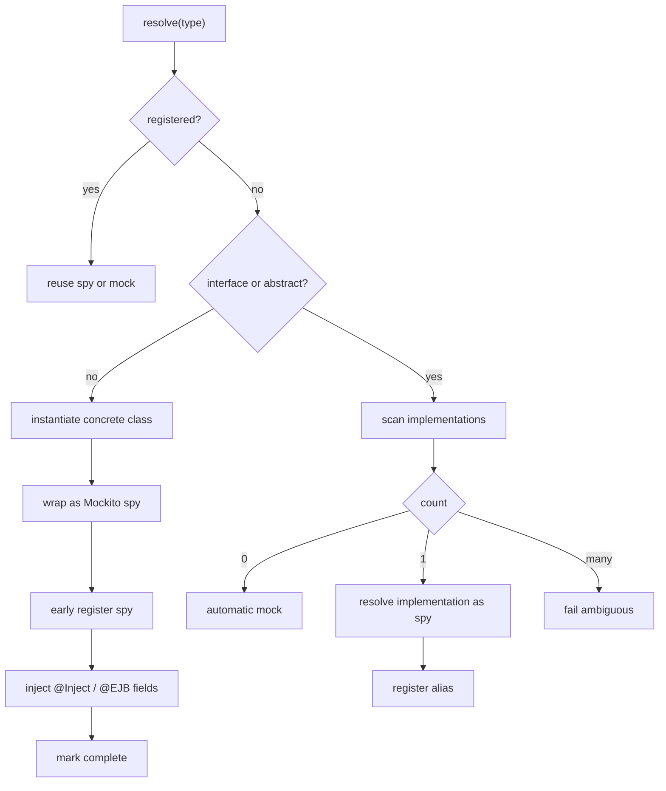
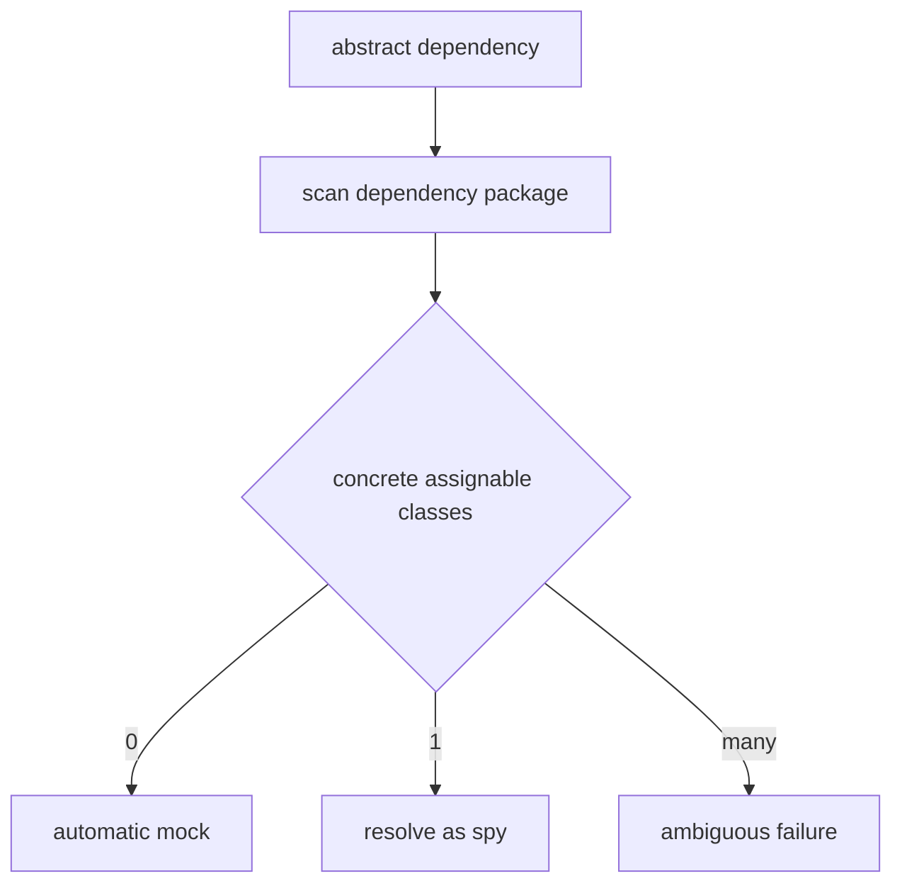
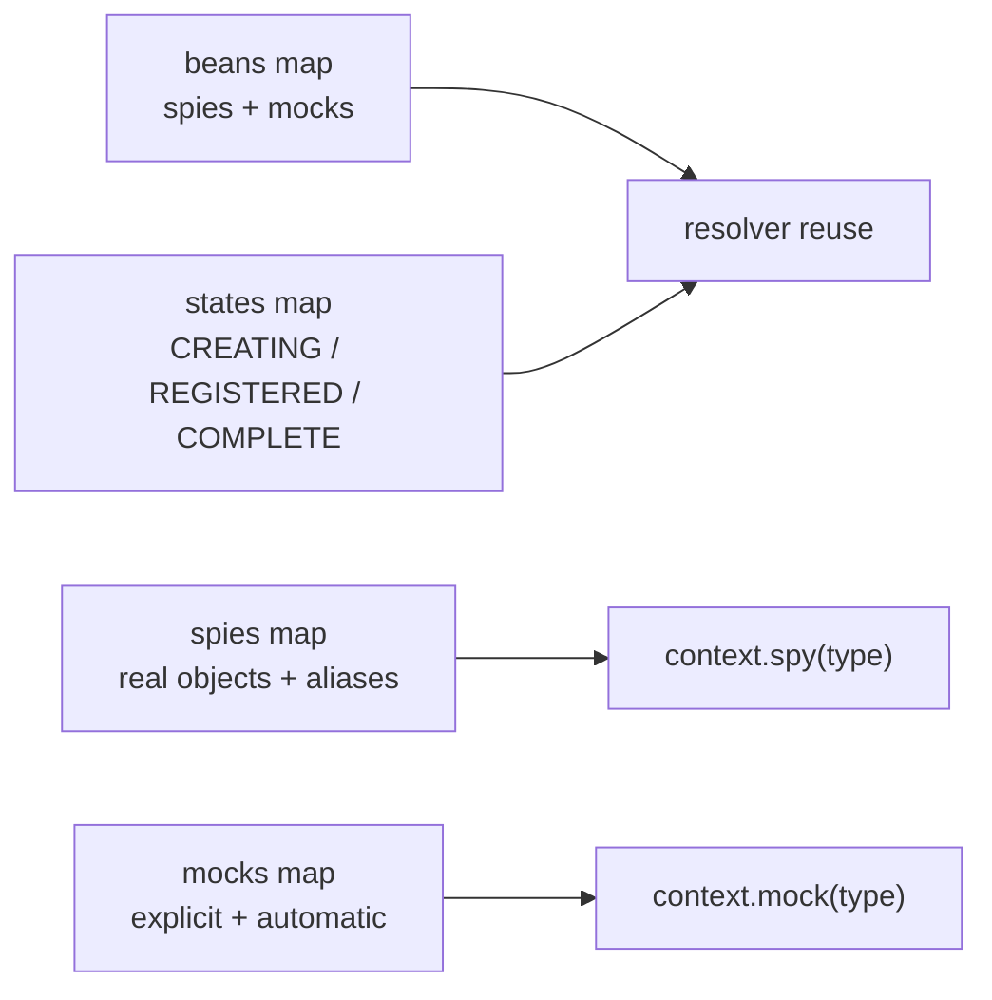
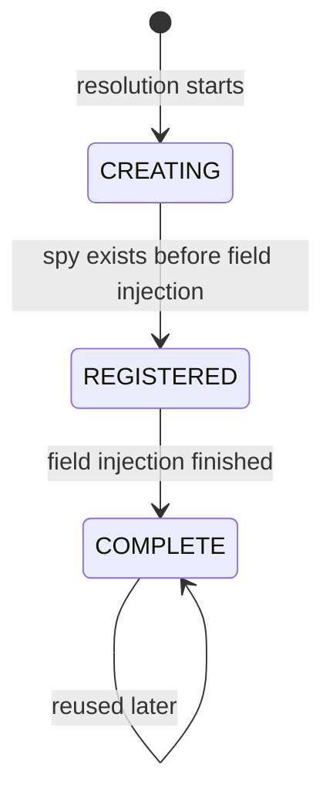
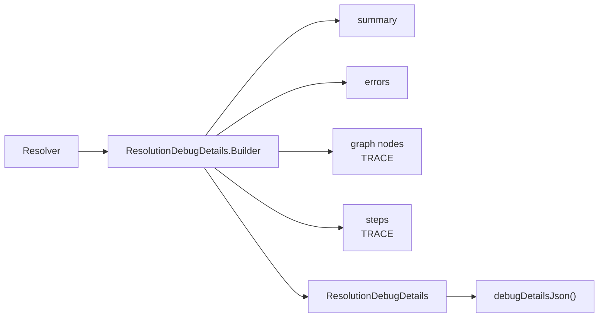
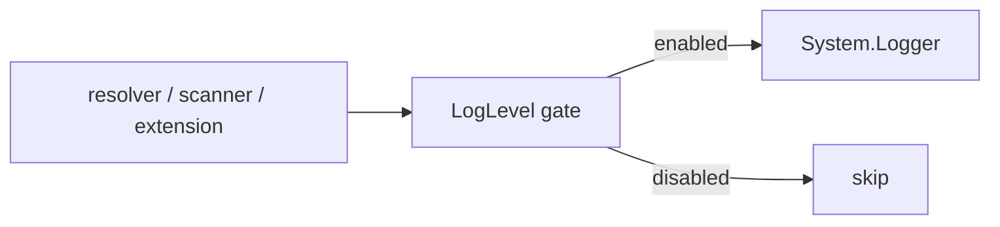
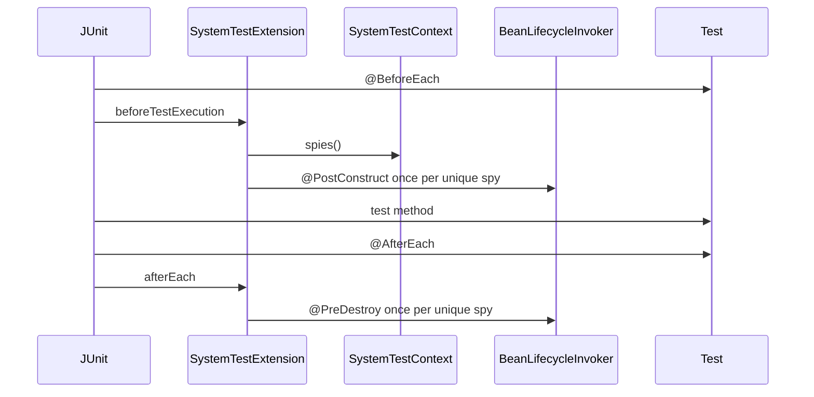

# Technical Reference

System Test Container is a test-time object graph resolver. It builds one shared context from root
classes, resolves dependencies, wraps real objects as Mockito spies, and uses Mockito mocks for
declared or unresolved external dependencies.

It does not start CDI, EJB, servlet infrastructure, or an application server.

Use this document when you need implementation-level behavior. For installation and first-use
examples, start with the [README](../README.md).

## Public API

```text
io.systemtest.container.api.context      context and builder API
io.systemtest.container.api.config       configuration enums
io.systemtest.container.api.extension    JUnit extension API
io.systemtest.container.api.debug        public debug model
io.systemtest.container.api.exception    public exceptions
```

Only `io.systemtest.container.api` packages are intended for users. Internal packages can change
while the project is in beta.

## Build Flow



A successful `build()` is cached by the builder instance. Later calls return the same context.

Root classes are only entry points for resolution. After the graph is built, users retrieve root
objects the same way as any other real object:

```java
ReservationEndpoint endpoint = context.spy(ReservationEndpoint.class);
```

## Resolution Rules



Resolver behavior:

- Explicit mocks are created before roots are resolved.
- Registered spies and mocks are reused across all roots.
- Concrete classes are instantiated and wrapped as Mockito spies.
- Spies are registered before field injection so field-based cycles can resolve.
- Interfaces and abstract classes use implementation discovery.
- No discovered implementation creates an automatic mock.
- One discovered implementation resolves to a spy and is aliased to the requested type.
- Multiple discovered implementations fail with `AmbiguousImplementationException`.
- Constructor-only cycles fail because no instance exists to register early.

## Constructor Injection

Constructor selection follows this order:

1. Use the single constructor annotated with `jakarta.inject.Inject`.
2. Otherwise, use the default constructor.
3. Otherwise, use the only declared constructor.

Resolution fails when:

- More than one constructor has `@Inject`.
- There is no default constructor and more than one non-annotated constructor exists.
- A constructor dependency creates a cycle before an instance can be registered.

## Field Injection

Field injection supports:

- `jakarta.inject.Inject`.
- Field-level `jakarta.ejb.EJB`.
- Fields declared on superclasses.

Injected fields must not be `static` or `final`.

For `@EJB`, the resolver uses the Java field type. It does not read attributes such as `lookup`,
`name`, `beanName`, or `beanInterface`.

## Implementation Discovery



The scanner is intentionally small in the beta:

- It scans the package of the requested interface or abstract class.
- It walks file-based classpath entries for that package.
- It ignores non-file classpath resources.
- It filters for concrete classes assignable to the requested type.
- It sorts candidates by class name for deterministic diagnostics.

Jar and advanced classpath scanning are planned improvements.

## Registry Model



The public API keeps spies and mocks separate:

- `spy(type)` returns only real objects wrapped as Mockito spies.
- `mock(type)` returns only Mockito mocks.
- Alias types can point to the same spy instance.
- Lifecycle callbacks run once per unique spy instance.

## Object States



`REGISTERED` supports field cycles:

```text
A
  -> B
      -> A
```

When `B` asks for `A`, the resolver can reuse the early registered `A` spy.

## Debug Model



Debug levels:

- `OFF`: returns the report shape without registered types, graph nodes, steps, or errors.
- `BASIC`: includes success, timing, registered spies, registered mocks, and errors.
- `TRACE`: adds graph nodes, resolver steps, paths, and step timings.

The builder keeps debug details from the last build attempt, including failed builds.

## Logging

The library uses `java.lang.System.Logger`.



`LogLevel` controls emitted logs. `DebugLevel` controls structured diagnostics. The default log
level is `WARN`, which keeps normal test runs quiet.

## Lifecycle Extension



Lifecycle methods can have any visibility. They must be non-static and have no parameters.

Strict mode throws lifecycle failures. Lenient mode records lifecycle failures in debug details and
allows the test to continue.
